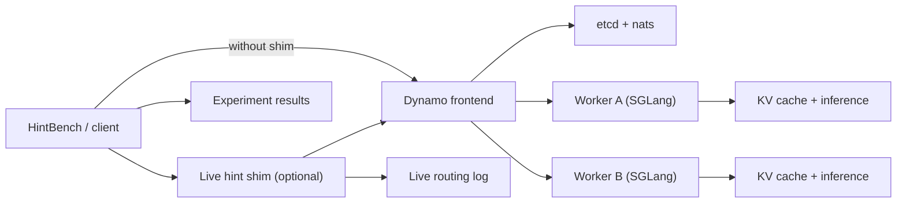

# kv_cache_offloading

Tools and experiment scaffolding for:

- single-node SGLang runs
- multi-node Dynamo + SGLang runs
- hint-guided routing experiments with HintBench

## Main Docs

- AWS/EC2 runbook: [aws/README.md](/Users/oluwolejaiyeoba/Documents/GitHub/kv_cache_offloading/aws/README.md)
- research plan: [PLAN.md](/Users/oluwolejaiyeoba/Documents/GitHub/kv_cache_offloading/PLAN.md)
- implementation status: [ROADMAP.md](/Users/oluwolejaiyeoba/Documents/GitHub/kv_cache_offloading/ROADMAP.md)
- HintBench harness: [hintbench/README.md](/Users/oluwolejaiyeoba/Documents/GitHub/kv_cache_offloading/hintbench/README.md)
- AgentBench single-GPU harness: [agentbench/README.md](/Users/oluwolejaiyeoba/Documents/GitHub/kv_cache_offloading/agentbench/README.md)

## Current Pipeline



## Processing Flow

1. `run_dynamo_head.sh` starts the control plane and frontend.
2. `run_dynamo_worker.sh` starts GPU workers and registers them with the head node.
3. `hintbench/run_experiment.py` or `hintbench/run_suite.py` sends requests to the frontend.
4. Optionally, `hintbench/runtime_patches/live_hint_router.py` sits in front of the frontend and logs hint-aware routing decisions.
5. Results go to `hintbench/results/`.

## Quick Start

Upload the repo:

```bash
/Users/oluwolejaiyeoba/Documents/GitHub/kv_cache_offloading/aws/upload.sh
```

Start the head node:

```bash
cd ~/kv_cache_offloading
sudo ./aws/bootstrap_ec2_docker.sh
DYNAMO_MODEL_PATH=Qwen/Qwen2.5-0.5B ./run_dynamo_head.sh start
./run_dynamo_head.sh status
./run_dynamo_head.sh logs
```

Start each worker:

```bash
cd ~/kv_cache_offloading
sudo ./aws/bootstrap_ec2_gpu.sh rootdisk
newgrp docker
./aws/check_ec2_rootdisk_worker_ready.sh
DYNAMO_MODEL_PATH=Qwen/Qwen2.5-0.5B \
DYNAMO_SERVED_MODEL_NAME=Qwen/Qwen2.5-0.5B \
ETCD_ENDPOINTS=http://<head-private-ip>:2379 \
./run_dynamo_worker.sh start
./run_dynamo_worker.sh status
./run_dynamo_worker.sh logs -f
```

Default worker flags in this setup:

```text
--enable-cache-report --enable-priority-scheduling --radix-eviction-policy lru
```

Run one benchmark:

```bash
python3 hintbench/run_experiment.py \
  --config hintbench/experiments/baseline_round_robin.yaml \
  --frontend-url http://127.0.0.1:8000/v1/chat/completions
```

## Single-Host GH200 Mode

Use this for same-machine development and debugging when you want the head/frontend and one worker on the same host.

First-time bootstrap on the GH200 host:

```bash
cd ~/kv_cache_offloading
sudo ./aws/bootstrap_ec2_gpu.sh rootdisk
newgrp docker
./aws/check_ec2_rootdisk_worker_ready.sh
```

Start the single-host stack:

```bash
cd ~/kv_cache_offloading
./run_dynamo_single_host.sh start
```

Verify it:

```bash
cd ~/kv_cache_offloading
./run_dynamo_single_host.sh status
./run_dynamo_single_host.sh logs
./run_dynamo_single_host.sh logs -f
./run_dynamo_single_host.sh test
```

Run one short HintBench experiment:

```bash
cd ~/kv_cache_offloading
python3 hintbench/run_experiment.py \
  --config hintbench/experiments/baseline_round_robin.yaml \
  --frontend-url http://127.0.0.1:8000/v1/chat/completions
```

Run one long HintBench experiment:

```bash
cd ~/kv_cache_offloading
python3 hintbench/run_experiment.py \
  --config hintbench/experiments/baseline_round_robin_long.yaml \
  --frontend-url http://127.0.0.1:8000/v1/chat/completions
```

Run one very long HintBench experiment:

```bash
cd ~/kv_cache_offloading
python3 hintbench/run_experiment.py \
  --config hintbench/experiments/baseline_round_robin_very_long.yaml \
  --frontend-url http://127.0.0.1:8000/v1/chat/completions
```

Stop the single-host stack:

```bash
cd ~/kv_cache_offloading
./run_dynamo_single_host.sh stop
```

Use this mode for:

- functional validation
- HintBench iteration
- live hint-shim testing on one machine

Do not treat it as a substitute for the real two-worker routing setup.

Run the standard 3-config suite:

```bash
python3 hintbench/run_suite.py \
  --frontend-url http://127.0.0.1:8000/v1/chat/completions
```

---

# Live Hint Shim

> Advanced / optional path. Use this after the standard Dynamo + HintBench flow is already working.

Run the shim in front of the frontend:

```bash
export HINTBENCH_UPSTREAMS_JSON='[
  {"worker_id":"frontend-a","url":"http://127.0.0.1:8000/v1/chat/completions"}
]'

python3 hintbench/runtime_patches/live_hint_router.py \
  --host 127.0.0.1 \
  --port 8100
```

Then send traffic through it:

```bash
python3 hintbench/run_experiment.py \
  --config hintbench/experiments/baseline_round_robin.yaml \
  --frontend-url http://127.0.0.1:8100/v1/chat/completions
```

Analyze the live routing log:

```bash
python3 hintbench/runtime_patches/analyze_live_router_log.py
```

Aggregate repeated live runs:

```bash
python3 hintbench/runtime_patches/aggregate_live_router_logs.py \
  hintbench/results/live_hint_router/run1.jsonl \
  hintbench/results/live_hint_router/run2.jsonl \
  hintbench/results/live_hint_router/run3.jsonl
```

---

## Key Scripts

- [run_dynamo_head.sh](/Users/oluwolejaiyeoba/Documents/GitHub/kv_cache_offloading/run_dynamo_head.sh): starts the head node
- [run_dynamo_worker.sh](/Users/oluwolejaiyeoba/Documents/GitHub/kv_cache_offloading/run_dynamo_worker.sh): starts one worker
- [run_dynamo_single_host.sh](/Users/oluwolejaiyeoba/Documents/GitHub/kv_cache_offloading/run_dynamo_single_host.sh): starts head + one worker on the same machine
- [run_docker_sglang.sh](/Users/oluwolejaiyeoba/Documents/GitHub/kv_cache_offloading/run_docker_sglang.sh): single-node SGLang flow
- [aws/bootstrap_ec2_docker.sh](/Users/oluwolejaiyeoba/Documents/GitHub/kv_cache_offloading/aws/bootstrap_ec2_docker.sh): simple Docker bootstrap
- [aws/bootstrap_ec2_gpu.sh](/Users/oluwolejaiyeoba/Documents/GitHub/kv_cache_offloading/aws/bootstrap_ec2_gpu.sh): GPU worker bootstrap
- [aws/check_ec2_rootdisk_worker_ready.sh](/Users/oluwolejaiyeoba/Documents/GitHub/kv_cache_offloading/aws/check_ec2_rootdisk_worker_ready.sh): root-disk worker readiness
- [aws/expand_root_fs.sh](/Users/oluwolejaiyeoba/Documents/GitHub/kv_cache_offloading/aws/expand_root_fs.sh): expand `/` after increasing the root EBS volume

## Notes

- Use `g5.xlarge` or `g5.2xlarge` for Dynamo workers.
- Do not use `g4dn.xlarge` for this Dynamo setup.
- The root-disk worker flow is the default recommended path.
- Use the head node’s private IP for `ETCD_ENDPOINTS`.
