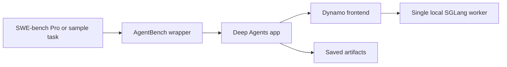

# kv_cache_offloading

Single-GPU AgentBench and Dynamo/SGLang experiment scaffolding.

## Main Docs

- AgentBench harness: [agentbench/README.md](/Users/oluwolejaiyeoba/Documents/GitHub/kv_cache_offloading/agentbench/README.md)
- AWS/EC2 runbook: [aws/README.md](/Users/oluwolejaiyeoba/Documents/GitHub/kv_cache_offloading/aws/README.md)
- EC2 setup notes: [EC2_SETUP.md](/Users/oluwolejaiyeoba/Documents/GitHub/kv_cache_offloading/EC2_SETUP.md)
- research plan: [PLAN.md](/Users/oluwolejaiyeoba/Documents/GitHub/kv_cache_offloading/PLAN.md)
- implementation status: [ROADMAP.md](/Users/oluwolejaiyeoba/Documents/GitHub/kv_cache_offloading/ROADMAP.md)

## Current Pipeline



## Quick Start

Upload the repo:

```bash
/Users/oluwolejaiyeoba/Documents/GitHub/kv_cache_offloading/aws/upload.sh
```

Bootstrap the EC2 machine:

```bash
cd ~/kv_cache_offloading
sudo ./aws/bootstrap_ec2_gpu.sh rootdisk
newgrp docker
./aws/check_ec2_rootdisk_worker_ready.sh
```

Start the single-host stack:

```bash
cd ~/kv_cache_offloading
./run_dynamo_single_host.sh start
./run_dynamo_single_host.sh status
./run_dynamo_single_host.sh test
```

Run AgentBench:

```bash
cd ~/kv_cache_offloading
bash agentbench/run_upstream_deploy_coding_agent_single_host.sh
```

Run AgentBench on SWE-bench Pro:

```bash
cd ~/kv_cache_offloading
bash agentbench/run_upstream_deploy_coding_agent_single_host.sh \
  --dataset ScaleAI/SWE-bench_Pro \
  --split test \
  --index 0
```

## Key Scripts

- [run_dynamo_head.sh](/Users/oluwolejaiyeoba/Documents/GitHub/kv_cache_offloading/run_dynamo_head.sh): starts the control-plane frontend
- [run_dynamo_worker.sh](/Users/oluwolejaiyeoba/Documents/GitHub/kv_cache_offloading/run_dynamo_worker.sh): starts one worker
- [run_dynamo_single_host.sh](/Users/oluwolejaiyeoba/Documents/GitHub/kv_cache_offloading/run_dynamo_single_host.sh): starts the single-host setup
- [agentbench/deepagents_swebench_single_host.py](/Users/oluwolejaiyeoba/Documents/GitHub/kv_cache_offloading/agentbench/deepagents_swebench_single_host.py): AgentBench wrapper
- [agentbench/deepagents_app/src/agent.py](/Users/oluwolejaiyeoba/Documents/GitHub/kv_cache_offloading/agentbench/deepagents_app/src/agent.py): Deep Agents app wiring

## Notes

- `agentbench/` is the active benchmark harness.
- automatic SWE-bench repo checkouts are stored under `agentbench/repos/`
- run artifacts are stored under `agentbench/results/`
