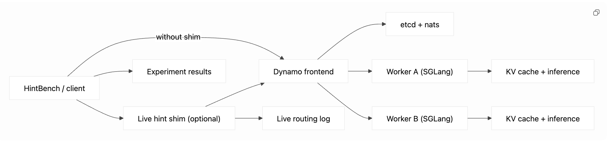

# HintBench

`hintbench/` is the benchmark harness for hint-guided Dynamo + SGLang experiments.

## Pipeline



## Prerequisite

Start the serving cluster first.

Head node:

```bash
cd ~/kv_cache_offloading
sudo ./aws/bootstrap_ec2_docker.sh
DYNAMO_MODEL_PATH=Qwen/Qwen2.5-0.5B ./run_dynamo_head.sh start
./run_dynamo_head.sh status
./run_dynamo_head.sh logs
hostname -I
```

Worker node:

```bash
cd ~/kv_cache_offloading
sudo ./aws/bootstrap_ec2_gpu.sh rootdisk
newgrp docker
./aws/check_ec2_rootdisk_worker_ready.sh
DYNAMO_MODEL_PATH=Qwen/Qwen2.5-0.5B \
DYNAMO_SERVED_MODEL_NAME=Qwen/Qwen2.5-0.5B \
ETCD_ENDPOINTS=http://<head-private-ip>:2379 \
./run_dynamo_worker.sh start
./run_dynamo_worker.sh status
./run_dynamo_worker.sh logs -f
```

Use `g5.xlarge` or `g5.2xlarge` for workers.

## Run One Experiment

```bash
python3 hintbench/run_experiment.py \
  --config hintbench/experiments/baseline_round_robin.yaml \
  --frontend-url http://127.0.0.1:8000/v1/chat/completions
```

Outputs go to:

- `hintbench/results/<experiment_name>_<timestamp>/`

Each run directory contains:

- `metadata.json`
- `workload.jsonl`
- `results.jsonl`
- `summary.json`

Result timestamps default to `America/Chicago`.

Outgoing requests are OpenAI-style requests with hints attached under `nvext.agent_hints`:

```json
{
  "model": "Qwen/Qwen2.5-0.5B",
  "messages": ["..."],
  "max_tokens": 128,
  "temperature": 0.0,
  "nvext": {
    "agent_hints": {
      "priority": 5,
      "reuse_likelihood": 0.9,
      "agent_phase": "execution",
      "expected_output_tokens": 128
    }
  }
}
```

## Run the Standard Suite

```bash
python3 hintbench/run_suite.py \
  --frontend-url http://127.0.0.1:8000/v1/chat/completions
```

This runs:

- `baseline_round_robin`
- `kv_router`
- `hint_routing`

`run_suite.py` restarts the head node between runs, checks `/v1/models`, and writes:

- per-run folders under `hintbench/results/`
- one suite folder under `hintbench/results/suite_<timestamp>/`

Suite outputs include:

- `comparison.txt`
- `comparison.json`
- `latency.txt`
- `latency.json`
- `cached_tokens.txt`
- `cached_tokens.json`
- `worker_distribution.txt`
- `worker_distribution.json`

## Run the Longer Suite

```bash
python3 hintbench/run_suite.py \
  --long \
  --frontend-url http://127.0.0.1:8000/v1/chat/completions
```

This uses:

- `baseline_round_robin_long.yaml`
- `kv_router_long.yaml`
- `hint_routing_long.yaml`

Use the short suite for fast checks and the long suite for more stable evaluation.

## Run the Very Long Suite

```bash
python3 hintbench/run_suite.py \
  --very-long \
  --frontend-url http://127.0.0.1:8000/v1/chat/completions
```

This uses:

- `baseline_round_robin_very_long.yaml`
- `kv_router_very_long.yaml`
- `hint_routing_very_long.yaml`

Use this for the heaviest stability checks and the largest comparison runs.

## Compare Existing Runs

```bash
python3 hintbench/analysis/compare_runs.py \
  hintbench/results/baseline_round_robin_20260504_163703 \
  hintbench/results/kv_router_20260504_164046 \
  hintbench/results/hint_routing_20260504_164139
```

## Analysis Scripts

Latency:

```bash
python3 hintbench/analysis/plot_latency.py \
  hintbench/results/baseline_round_robin_20260505_101759 \
  hintbench/results/kv_router_20260505_101810 \
  hintbench/results/hint_routing_20260505_101816
```

Cached tokens:

```bash
python3 hintbench/analysis/plot_cached_tokens.py \
  hintbench/results/baseline_round_robin_20260505_101759 \
  hintbench/results/kv_router_20260505_101810 \
  hintbench/results/hint_routing_20260505_101816
```

Worker distribution:

```bash
python3 hintbench/analysis/plot_worker_distribution.py \
  hintbench/results/baseline_round_robin_20260505_101759 \
  hintbench/results/kv_router_20260505_101810 \
  hintbench/results/hint_routing_20260505_101816
```

## Runtime Patch Layer

Runtime-patch docs live here:

- [hintbench/runtime_patches/README.md](/Users/oluwolejaiyeoba/Documents/GitHub/kv_cache_offloading/hintbench/runtime_patches/README.md)

Offline simulation:

```bash
python3 hintbench/runtime_patches/simulate_hint_router.py \
  --run-dir hintbench/results/baseline_round_robin_20260505_101759
```

---

# Live Hint Shim

> Advanced / optional path. Use this after the standard HintBench experiment flow is already working.

Start the shim:

```bash
export HINTBENCH_UPSTREAMS_JSON='[
  {"worker_id":"frontend-a","url":"http://127.0.0.1:8000/v1/chat/completions"}
]'

python3 hintbench/runtime_patches/live_hint_router.py \
  --host 127.0.0.1 \
  --port 8100 \
  --log-file hintbench/results/live_hint_router/short_run1.jsonl
```

Short live-shim run:

```bash
python3 hintbench/run_experiment.py \
  --config hintbench/experiments/baseline_round_robin.yaml \
  --frontend-url http://127.0.0.1:8100/v1/chat/completions
```

Long live-shim run:

```bash
python3 hintbench/run_experiment.py \
  --config hintbench/experiments/baseline_round_robin_long.yaml \
  --frontend-url http://127.0.0.1:8100/v1/chat/completions
```

Very long live-shim run:

```bash
python3 hintbench/run_experiment.py \
  --config hintbench/experiments/baseline_round_robin_very_long.yaml \
  --frontend-url http://127.0.0.1:8100/v1/chat/completions
```

Analyze one live log:

```bash
python3 hintbench/runtime_patches/analyze_live_router_log.py --log-file hintbench/results/live_hint_router/short_run1.jsonl
```

Friendly backend names come from:

- [hintbench/runtime_patches/worker_name_map.json](/Users/oluwolejaiyeoba/Documents/GitHub/kv_cache_offloading/hintbench/runtime_patches/worker_name_map.json)

Aggregate repeated live runs:

```bash
python3 hintbench/runtime_patches/aggregate_live_router_logs.py \
  hintbench/results/live_hint_router/run1.jsonl \
  hintbench/results/live_hint_router/run2.jsonl \
  hintbench/results/live_hint_router/run3.jsonl
```

With one upstream, the shim logs live hint-aware decisions but does not override Dynamo’s internal worker choice.

---
